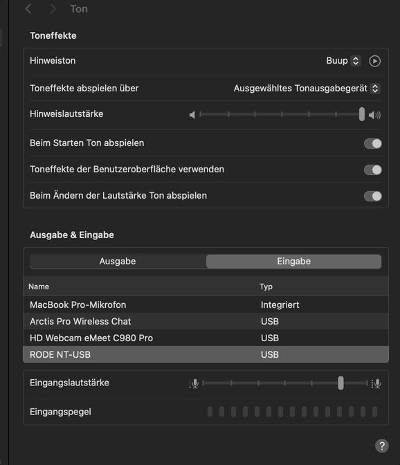

# 🎙️ Mac Mic Lock - Lock Microphone Input Volume

You’re in a Teams or Zoom call on your Mac, and suddenly your microphone input volume changes by itself—making you too quiet or too loud, with no way to stop it? Sounds familiar? Then check out this **lightweight shell tool for macOS** that **automatically keeps your microphone input volume fixed**—even when apps like **Microsoft Teams** or **Zoom** try to change it without providing an option to disable this behavior 😡.

This background script **continuously monitors your mic input level** and instantly resets it to your preferred setting, ensuring consistent audio quality for calls, recordings, and streaming. 

Perfect for anyone frustrated by unexpected mic volume changes on macOS. **Keep your microphone input stable!**



## 🔧 How it Works

- A shell script checks the current microphone input level every 0.5 seconds
- If it deviates from the target value (default: 85%), it's immediately reset (can easily be changed in script)
- A macOS `LaunchAgent` ensures the script starts automatically at user login

## 📦 Installation

1. Clone the repository:
```bash
git clone https://github.com/hbertsch/macos-microphone-input-volume-locker.git
cd macos-microphone-input-volume-locker
```

2. Run the installation script:
```bash
# eventually you need to chmod the file first: chmod +x register-daemon.sh
./register-daemon.sh
```

The service will start immediately and continuously monitor your microphone level.

## 🧪 Verify Installation

Check if the service is running:
```bash
launchctl list | grep com.user.miclock
```
If a line appears (with PID or exit code 0), the service is active.

## 🔄 Uninstallation

To remove the tool:
```bash
chmod +x unregister-daemon.sh
./unregister-daemon.sh
```
This will remove the LaunchAgent and optionally delete the shell script.

## ⚙️ Configuration

### Changing Microphone Level

1. Open `mac-mic-control.sh` and modify this line:
```bash
TARGET_VOLUME=85  # Set desired input level (0-100)
```

2. Reinstall/restart the service:
```bash
./register-daemon.sh
```

## ⚠️ Performance Warning

A very low sleep interval (e.g., less than 2-3 seconds) in the monitoring script can lead to increased CPU usage by the macOS process `/usr/sbin/coreaudiod`. This may be visible in the Activity Monitor as higher CPU consumption. If you notice this, consider increasing the sleep value in `mac-mic-control.sh` to reduce system load.

## 📁 Project Structure

```
.
├── mac-mic-control.sh         # Volume monitoring shell script
├── com.user.miclock.plist     # LaunchAgent template
├── register-daemon.sh         # Installation script
├── unregister-daemon.sh       # Uninstallation script
└── README.md                  # This documentation
```

## 🛡️ Note

This tool:
- Doesn't modify system files
- Doesn't require administrative privileges
- Doesn't interfere with other audio settings
- Can be removed cleanly at any time

## 🧑‍💻 License

Creative Commons Attribution-NonCommercial 4.0 International (CC BY-NC 4.0)
Contributions welcome!